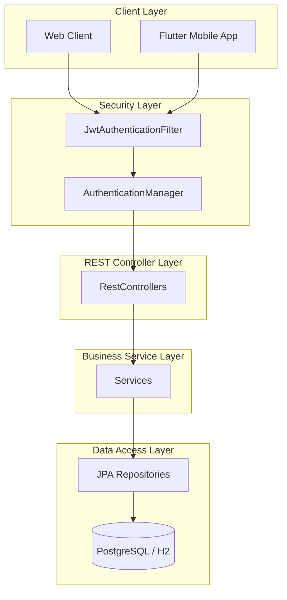
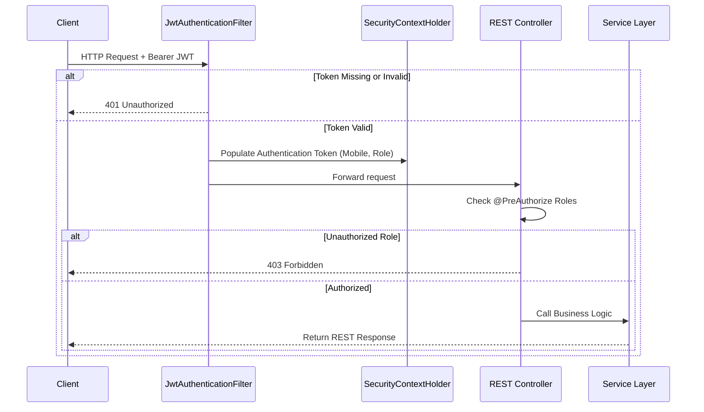
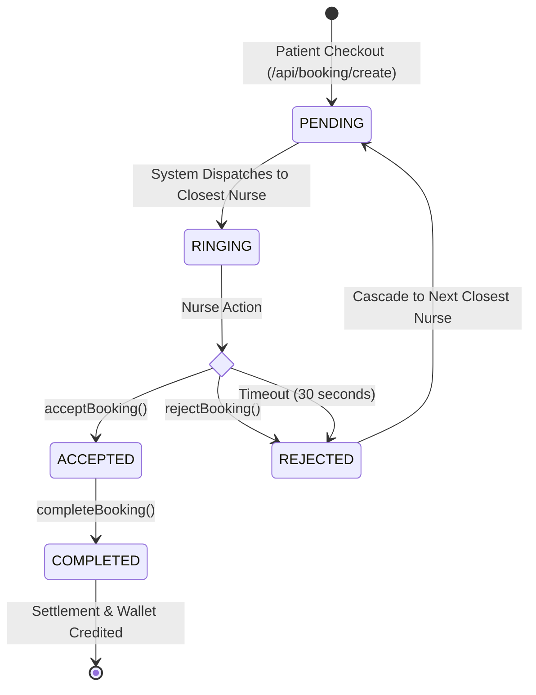
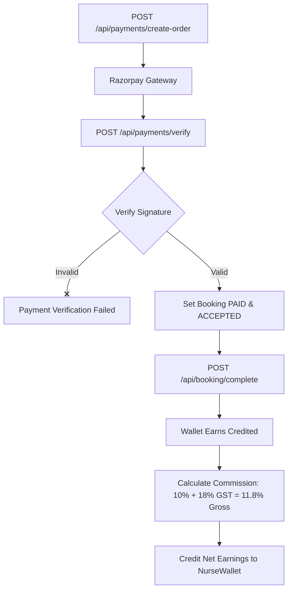

# Pro Nurse Backend API - Complete Developer Guide

Welcome to the official developer guide for the **Pro Nurse Backend API**, maintained by the engineering team at **Biruma Technology Solutions Pvt Ltd.** This guide outlines the overall architecture, core workflows, package design, and standards required for extending and maintaining the platform.

---

## 1. System Architecture Overview

Pro Nurse is built on a layered, stateless architectural model utilizing **Spring Boot**. The backend acts as a RESTful web service communicating over HTTPS, supplemented by a WebSocket server for real-time location streaming.



### Layer Responsibilities

1. **Controller Layer (`com.pronurse.*.controller`)**:
   - Manages HTTP endpoint routes, binds incoming parameters, and invokes standard role validation (`@PreAuthorize`).
   - Translates exceptions caught from services into REST-friendly `ApiResponse` payloads using the `GlobalExceptionHandler`.
   
2. **Service Layer (`com.pronurse.*.service`)**:
   - Orchestrates the application's business rules.
   - Enforces transactional boundaries (`@Transactional`).
   - Calls third-party gateways (e.g., Razorpay, FCM, Twilio).

3. **Repository Layer (`com.pronurse.*.repository`)**:
   - Manages DB queries. Includes Spring Data JPA repositories, native PostgreSQL queries, and spatial logic.

4. **Entity/DTO Layer (`com.pronurse.*.entity` and `com.pronurse.*.dto`)**:
   - Entities define the schema mappings.
   - DTOs (Data Transfer Objects) define validation constraints (`@NotBlank`, `@NotNull`) and Swagger/OpenAPI `@Schema` mappings for API serialization.

---

## 2. Core Technical Workflows

### 2.1 Request & Authentication Lifecycle

Every request sent to a protected endpoint goes through the security filter chain:



#### OTP Login & Refresh Token Rotation
- **`POST /api/auth/otp/send`**: Generates a random OTP, sends it to the user's mobile number via SMS (or mock provider), and caches the state in memory.
- **`POST /api/auth/otp/verify`**: Validates the OTP. On success, it returns an access token in the response body and sets a secure `HttpOnly`, `SameSite=Strict` cookie containing a `refreshToken`.
- **`POST /api/auth/refresh`**: Reads the `refreshToken` cookie, rotates it (issues a new access token and a brand new refresh token), and updates the cookie.

---

### 2.2 Booking & Dispatch Lifecycle

The dispatch engine routes service bookings to the closest available nurse.



1. **Booking Placement:** Patient creates a booking specifying services, time, and coordinates (`latitude`/`longitude`). The booking status is marked `PENDING`.
2. **Intelligent Match (Haversine formula):** The system triggers `BookingRepository.findNextClosestNurseId(...)`. This runs a native query calculating distance:
   $$\text{Distance} = 6371 \times \text{acos}\left(\cos(\text{rad}(lat_1)) \cos(\text{rad}(lat_2)) \cos(\text{rad}(lon_2) - \text{rad}(lon_1)) + \sin(\text{rad}(lat_1)) \sin(\text{rad}(lat_2))\right)$$
3. **Cascading Notification:** An assignment (`BookingAssignment`) is created with a `RINGING` status. The target nurse has a **30-second response window**.
   - **Acceptance:** Status changes to `ACCEPTED`. The nurse is locked to the booking.
   - **Rejection/Timeout:** Status changes to `REJECTED`. The system automatically triggers the cascade, matching the next closest nurse.

---

### 2.3 Payment & Wallet Flow



#### Earnings Logic:
For every completed booking:
- **Gross Amount** = Charged price of selected services.
- **Platform Fee** = 10% platform fee.
- **GST on Fee** = 18% of the platform fee (1.8% of the gross).
- **Total Deduction** = 11.8% of the gross.
- **Net Earnings** = 88.2% of the gross credited to `NurseWallet`.

---

## 3. Coding Guidelines & Standards

### 3.1 Naming Conventions
- **Controllers**: End with `Controller.java` (e.g., `NurseActionController.java`).
- **Services**: Interfaces in the main package (e.g., `BookingService.java`), implementations in `.service` package ending in `ServiceImpl.java`.
- **Repositories**: Extend `JpaRepository` and end with `Repository.java`.
- **DTOs**: Placed in `.dto` packages and suffixed with `Request` or `Response`.
- **Field Names**: CamelCase inside Java code, converted dynamically or manually mapped to snake_case in client integrations.

---

## 4. How-To Developer Guides

### 4.1 How to Add a New API Endpoint

1. **Define DTOs (if required):**
   Create the request and response models under the target module's `dto` folder:
   ```java
   @Data
   @Schema(description = "Details for custom request")
   public class CustomRequest {
       @NotBlank(message = "Identifier field is mandatory")
       @Schema(description = "Booking registration number", example = "BOOK-102")
       private String bookingNo;
   }
   ```

2. **Add Service Method:**
   Declare the method in the interface and implement the business logic in the service implementation:
   ```java
   void performCustomAction(CustomRequest request, String userMobile);
   ```

3. **Expose Controller Route:**
   Map the endpoint in the respective controller, including security checks and Swagger annotations:
   ```java
   @PostMapping("/custom-action")
   @PreAuthorize("hasRole('PATIENT')")
   @Operation(summary = "Execute custom action", description = "Authorized operation for patients")
   @ApiResponses(value = {
       @ApiResponse(responseCode = "200", description = "Action completed successfully"),
       @ApiResponse(responseCode = "400", description = "Invalid payload details"),
       @ApiResponse(responseCode = "401", description = "Unauthorized client token")
   })
   public ResponseEntity<ApiResponse<Void>> executeAction(
           @Valid @RequestBody CustomRequest request, Authentication authentication) {
       
       String mobile = (String) authentication.getPrincipal();
       customService.performCustomAction(request, mobile);
       return ResponseEntity.ok(new ApiResponse<>(true, "Action processed successfully"));
   }
   ```

---

## 5. Quality & Verification Standards

### 5.1 Verification Checklist
Before submitting code for pull requests:
- [ ] Run `mvn clean compile` to ensure zero compilation warnings or errors.
- [ ] Run `mvn test` to verify that all 47 tests pass successfully.
- [ ] Verify that all new endpoints are documented via Swagger (`http://localhost:8080/swagger-ui/index.html`).

---

## 📞 Support & Footer

This guide is maintained by the engineering team at:

**Company:** Biruma Technology Solutions Pvt Ltd.  
**Website:** [desitechsolutions.com](https://desitechsolutions.com)  
**Support Email:** [info@desitechsolutions.com](mailto:info@desitechsolutions.com)  

Copyright © 2026 Biruma Technology Solutions Pvt Ltd. All rights reserved.
